  

  

  
  

<h1 align="center">Md Kaif</h1>

Electronics Engineer · Embedded Systems Developer · IoT Builder · Full Stack Developer

  Building production-minded hardware + software systems with a focus on reliability, speed, and product quality.

---
## Contribution Snake

  <picture>
    <source media="(prefers-color-scheme: dark)" srcset="assets/github-contribution-grid-snake-dark.svg" />
    <source media="(prefers-color-scheme: light)" srcset="assets/github-contribution-grid-snake.svg" />
    
  </picture>

## About

I design and ship engineering-led products across embedded systems, IoT platforms, PCB-level hardware, and modern web backends. My work is focused on turning prototypes into practical, deployable systems — with clean architecture, measurable impact, and AI-assisted engineering workflows baked into how I build.

## Technology Stack

**Languages**

**Frontend**

**Backend**

**Databases**

**Embedded**

**Hardware & PCB Design**

**Developer Tools**

**AI Tools**

  

<table align="center" width="100%">
<tr>
<td width="50%" valign="top">

### Alabuzer — Ecommerce Website

Engineering product initiative for connected systems, integrating embedded intelligence with dependable cloud-linked workflows.

</td>
<td width="50%" valign="top">

### Smart Home Automation

Started as a 2nd-year IoT group project — relays controlling appliances like bulbs and fans to save energy and add comfort. Now being scaled from that prototype toward a production-ready connected device.

</td>
</tr>
<tr>
<td width="50%" valign="top">

### Footstep Power Generation

Group embedded project — connected hardware built around robust embedded control, automation logic, and production-aware IoT integration.

</td>
<td width="50%" valign="top">

### Logic Power Supply

A logic power supply provides the low-voltage DC power (3.3V or 5V) that keeps digital circuits — microcontrollers, sensors, ICs — alive and running. The quiet backbone of any electronics project.

</td>
</tr>
<tr>
<td width="50%" valign="top">

### PabloCommerce

Commerce platform architecture focused on scalable backend services, modern frontend delivery, and maintainable product foundations.

</td>
<td width="50%" valign="top">

### Hexapod
 

Robotics R&D project exploring multi-actuator control, embedded coordination, and end-to-end system integration.

</td>
</tr>
</table>

## Current Focus

- Scaling **Smart Home Automation** from a 2nd-year prototype toward a production-ready connected device.
- Working on **Hexapod** — a college group project in multi-actuator robotics and embedded coordination.
- Scaling **PabloCommerce** architecture for performance and maintainability.

## GitHub Analytics

<!--
  Stats + Top Languages below are NOT the public github-readme-stats.vercel.app instance
  (that one is dead — frequent 503 "rate limit exceeded", left permanently unused). They're
  generated by scripts/generate-stats.mjs, which runs daily via
  .github/workflows/stats.yml using only the repo's built-in GITHUB_TOKEN — no personal
  access token, no external hosting, nothing to keep alive. See docs/profile-maintenance.md.
-->

  <picture>
    <source media="(prefers-color-scheme: dark)" srcset="assets/stats-overview-dark.svg" />
    <source media="(prefers-color-scheme: light)" srcset="assets/stats-overview.svg" />
    
  </picture>
  <picture>
    <source media="(prefers-color-scheme: dark)" srcset="assets/stats-top-langs-dark.svg" />
    <source media="(prefers-color-scheme: light)" srcset="assets/stats-top-langs.svg" />
    
  </picture>

  
  

## Connect

&nbsp;&nbsp;

&nbsp;&nbsp;

Portfolio site is coming soon — the badge above currently links to this GitHub profile.

  

Designed & Built by <strong>Md Kaif</strong> · Powered by <strong>Pabloch</strong>

